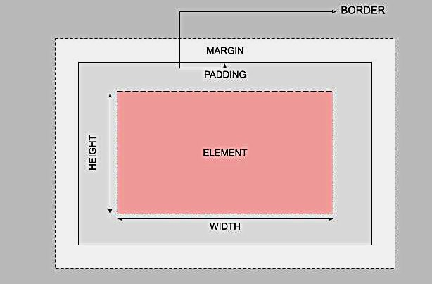

# CSS Positioning

## THE BOX MODEL

Every HTML element has a default display value, depending on what type of element it is.

There are two display values:

- block
- inline.

## INLINE ELEMENT

- An inline element does not start on a new line.

- An inline element only takes up as much width as necessary.

- This is a <span\> element inside a paragraph.

| Inline-Elements | Description |
| --------------- | ----------- |
| <a\>            |             |
| <abbr\>         |             |
| <acronym\>      |             |
| <b\>            |             |
| <bdo\>          |             |
| <big\>          |             |
| <br\>           |             |
| <button\>       |             |
| <cite\>         |             |
| <code\>         |             |
| <dfn\>          |             |
| <em\>           |             |
| <i\>            |             |
|           |             |
| <input\>        |             |
| <kbd\>          |             |
| <label\>        |             |
| <map\>          |             |
| <object\>       |             |
| <output\>       |             |
| <q\>            |             |
| <samp\>         |             |
| <script\>       |             |
| <select\>       |             |
| <small\>        |             |
| <span\>         |             |
| <strong\>       |             |
| <sub\>          |             |
| <sup\>          |             |
| <textarea\>     |             |
| <time\>         |             |
| <tt\>           |             |
| <var\>          |             |

## BLOCK LEVEL ELEMENT

- A block-level element always starts on a new line.

- A block-level element always takes up the full width available (stretches out to the left and right as far as it can).

- A block level element has a top and a bottom margin, whereas an inline element does not.

| Block-level-Element | Description |
| ------------------- | ----------- |
| <address\>          |             |
| <article\>          |             |
| <aside\>            |             |
| <blockquote\>       |             |
| <canvas\>           |             |
| <dd\>               |             |
| <div\>              |             |
| <dl\>               |             |
| <dt\>               |             |
| <fieldset\>         |             |
| <figcaption\>       |             |
| <figure\>           |             |
| <footer\>           |             |
| <form\>             |             |
| <h1\>-<h6\>         |             |
| <header\>           |             |
| <hr\>               |             |
| <li\>               |             |
| <main\>             |             |
| <nav\>              |             |
| <noscript\>         |             |
| <ol\>               |             |
| <p\>                |             |
| <pre\>              |             |
| <section\>          |             |
| <table\>            |             |
| <tfoot\>            |             |
| <ul\>               |             |
| <video\>            |             |
