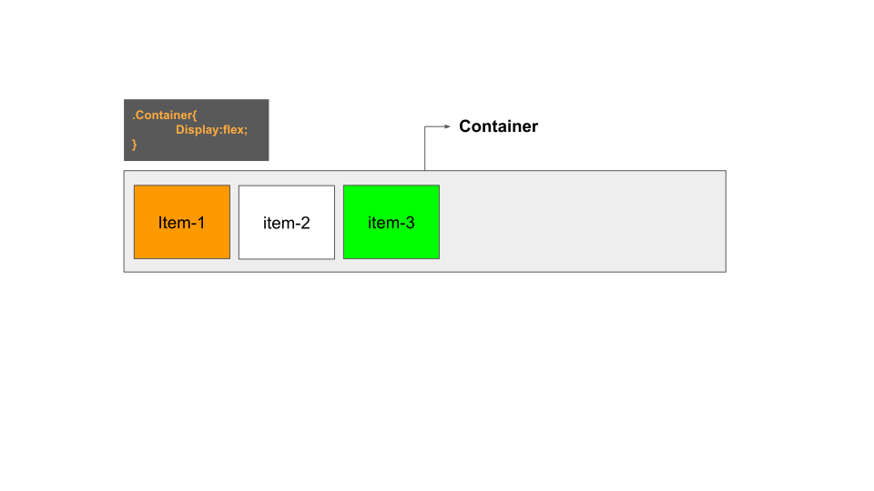
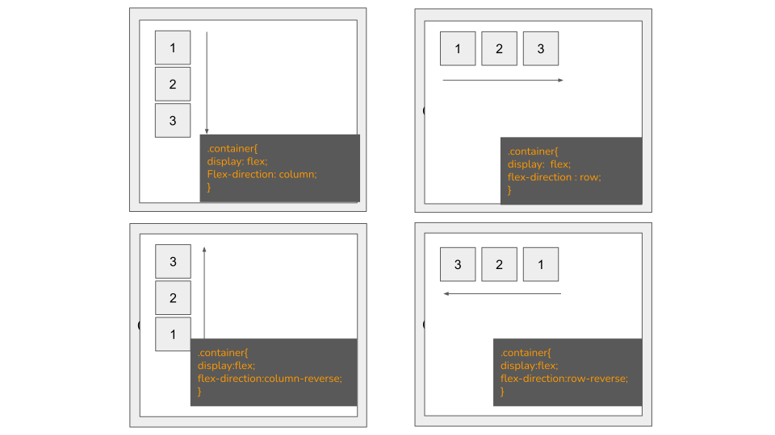
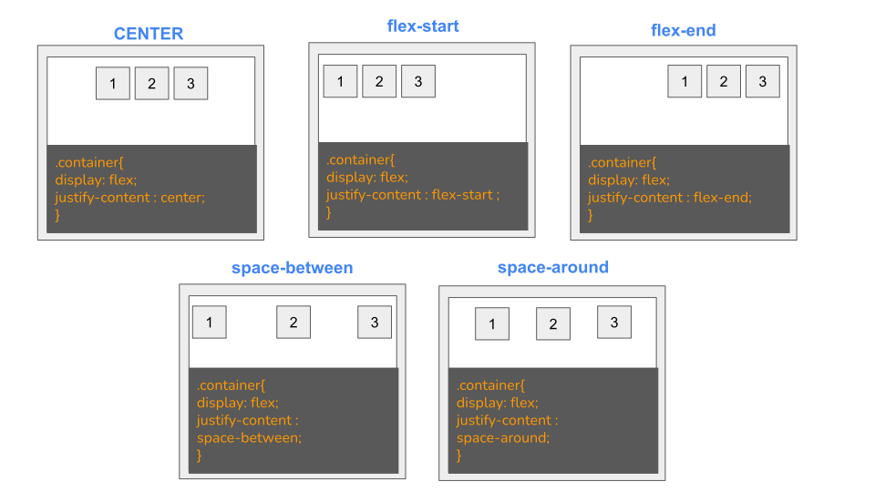

# FLEX BOX


- Apply a display type of flex to parent container.

## Benifits of flex box

- Navigation Bar & Menus
- Grid Layout
- Bar Chart
- Equal height column

# CSS Flex Container

### Parent Element (Container)



## Flex Container Properties

- flex-direction
- flex-wrap
- flex-flow
- justify-content
- align-items
- align-content

## flex-direction

The flex-direction property defines in which direction the container wants to stack the flex items.

### Flex direction can be of ":

- column
- column-reverse
- row
- row-reverse



## flex-wrap

**What is wrap ?**

The flex-wrap CSS property sets whether flex items are forced onto one line or can wrap onto multiple lines. If wrapping is allowed, it sets the direction that lines are stacked.

### Properties included in flex wrap:

- wrap
- wrap-reverse
- nowrap


## flex-flow

The flex-flow property is a shorthand property for setting both the flex-direction and flex-wrap properties.

```CSS
.container{
    display:flex;
    flex-flow:row wrap;
}
```

## justify-content

The justify-content property is used to align the flex items.

- center
- flex-start
- flex-end
- space-around
- space-between


