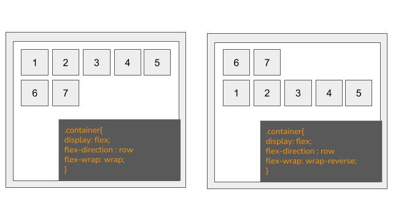
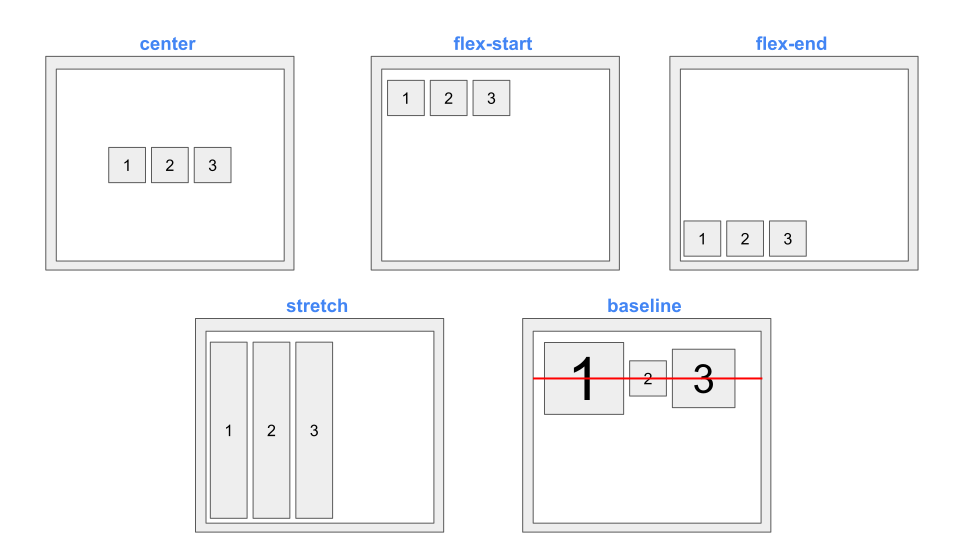
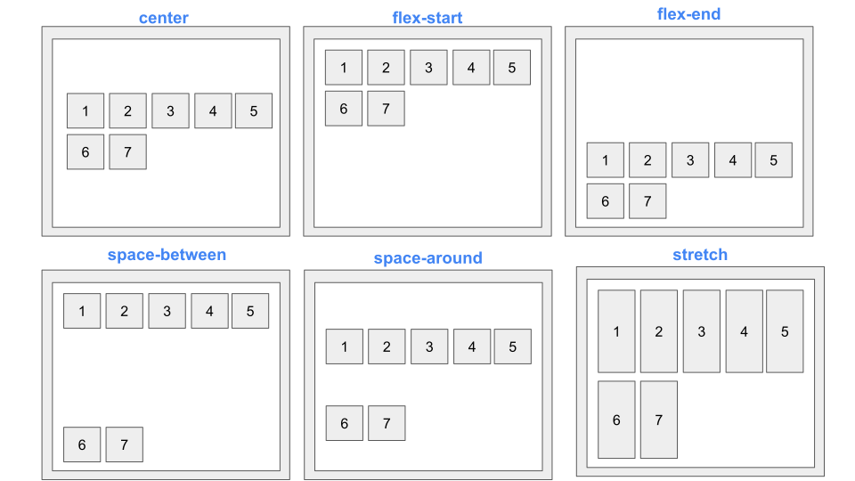

# FLEX BOX


- Apply a display type of flex to parent container.

## Benifits of flex box

- Navigation Bar & Menus
- Grid Layout
- Bar Chart
- Equal height column

# CSS Flex Container

### Parent Element (Container)


## Flex Container Properties

- ### flex-direction
  - Specifies the direction of the **flexible items** inside a flex container
- ### flex-wrap
  - Specifies whether the flex items should wrap or not, if there is not enough room for them on one flex line
- ### flex-flow
  - A shorthand property for flex-direction and flex-wrap
- ### justify-content
  - Horizontally aligns the flex items when the items do not use all available space on the main-axis
- ### align-items
  - Vertically aligns the flex items when the items do not use all available space on the cross-axis
- ### align-content
  - Modifies the behavior of the flex-wrap property. It is similar to align-items, but instead of aligning flex items, it aligns flex lines

## flex-direction

The flex-direction property defines in which direction the container wants to stack the flex items.

### Flex direction can be of ":

- column
- column-reverse
- row
- row-reverse


## flex-wrap

**What is wrap ?**

The flex-wrap CSS property sets whether flex items are forced onto one line or can wrap onto multiple lines. If wrapping is allowed, it sets the direction that lines are stacked.

### Properties included in flex wrap:

- wrap
- wrap-reverse
- nowrap



## flex-flow

The flex-flow property is a shorthand property for setting both the flex-direction and flex-wrap properties.

```CSS
.container{
    display:flex;
    flex-flow:row wrap;
}
```

## justify-content

The justify-content property is used to align the flex items.

- center
- flex-start
- flex-end
- space-around
- space-between


## align-item

The align-items property is used to align the flex items.

- center
- flex-start
- flex-end
- stretch
- baseline



## Align Content

The align-content property is used to align the flex lines.



# CSS Flex Items

The direct child elements of a flex container automatically becomes flexible (flex) items.

## The flex item properties are:

- ### order
  - Specifies the order of the flex items inside the same container
- ### flex-grow
  - Specifies how much a flex item will grow relative to the rest of the flex items inside the same container
- ### flex-shrink
  - Specifies how much a flex item will shrink relative to the rest of the flex items inside the same container
- ### flex-basis
  - Specifies the initial length of a flex item
- ### flex
  - A shorthand property for the flex-grow, flex-shrink, and the flex-basis properties
- ### align-self
  - Specifies the alignment for a flex item (overrides the flex container's align-items property)
